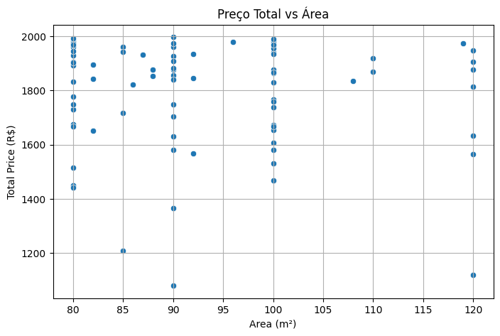
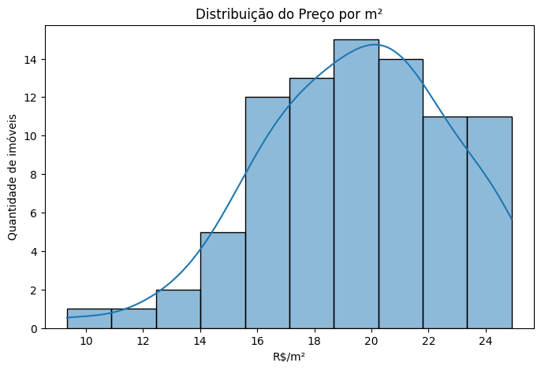
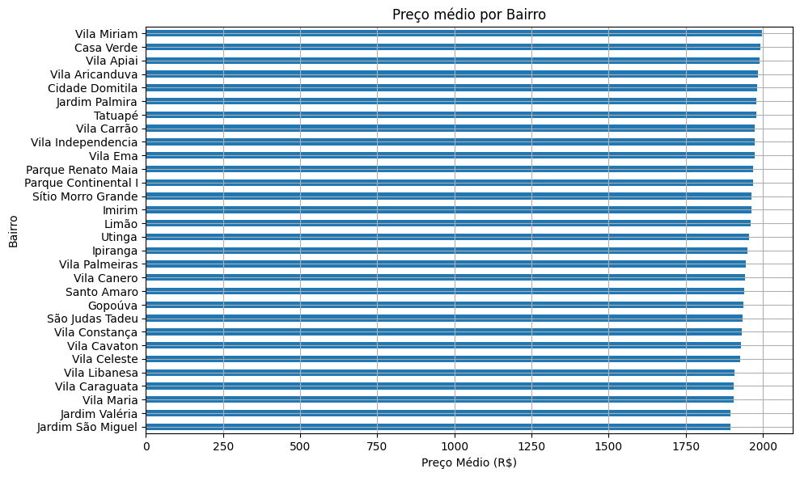
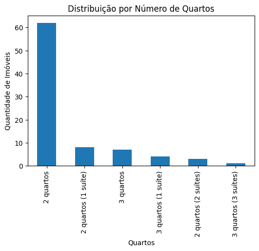
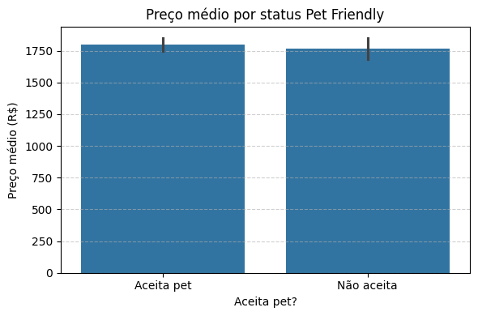

#### Automatização da busca por imóveis para alugar
Grupo: @leticiacb1 e @LidiaDomingos

Vídeo exemplo do funcionamento do projeto: 
[](https://www.youtube.com/watch?v=wYiN90g50ac)


---

##### Introdução 

Este projeto foi desenvolvido como parte da disciplina de Análise de Texto de Fontes Desestruturadas e Web e tem como objetivo automatizar a coleta de dados de imóveis para aluguel no site do QuintoAndar. Utilizando a biblioteca Selenium em conjunto com o gerenciador de dependências Poetry, construímos uma aplicação que permite ao usuário inserir filtros diretamente pelo terminal — como faixa de área, número de quartos, faixa de preço, entre outros. A partir desses filtros, o sistema interage com o site do QuintoAndar, realiza a busca correspondente e extrai as informações dos imóveis listados. Os resultados são então organizados e armazenados em um arquivo Excel que inclui dados como descrição do imóvel, localização, características e o link direto para o anúncio. Vale destacar que o foco do projeto foi exclusivamente em imóveis para aluguel, não abrangendo opções de compra.

---
##### Problema

Ao procurar imóveis para alugar em plataformas online como o QuintoAndar, os usuários se deparam com uma interface voltada para navegação individual dos anúncios, onde o objetivo principal acaba sendo a visualização das fotos. Embora visualmente agradável, essa estrutura não é fácil para quem precisa comparar várias opções de forma rápida e objetiva. Informações importantes como preço, número de quartos, localização e características específicas ficam espalhadas em diferentes páginas, dificultando uma análise mais ampla e estratégica.

Nosso projeto resolve esse problema ao extrair os dados de imóveis filtrados e organizá-los de forma enxuta e padronizada em uma planilha Excel. Isso permite que o usuário visualize todas as opções de uma vez só, bem mais rápido do que tendo que ficar clicando no botão Ver Mais, por exemplo, e tenha a possibilidade de comparar facilmente os imóveis com base em diferentes critérios e tome decisões mais informadas. Além disso, o Excel facilita o uso de filtros, gráficos ou fórmulas, tornando a análise mais rápida, personalizada e eficiente — algo que a navegação pelo site, sozinha, não proporciona.

---

##### Extração dos dados

Toda a nossa extração foi feita na função `main` que chama outras funções para tratar os dados, cada função está comentada no código, mas segue abaixo breves descrições sobre elas.

1.  Navegação e Busca Inicial

- Função `local_search` (snippet)

```python
def local_search(driver, city, neighborhood = None , amount = None, number_of_rooms = None):
    """
    Auxilitary function to go to the filters page
    """
    # City Input
    city_input = driver.find_element(By.NAME, "landing-city-input")
    city_input.click()
    city_input.send_keys(city)

    # Neighborhood Input
    city_neighborhood = driver.find_element(By.NAME, "landing-neighborhood-input")
    city_neighborhood.click()
    city_neighborhood.send_keys(neighborhood)

```

Essa função cuida da parte inicial da página do Quinto Andar, a qual é possível definir o bairro, cidade e alguns filtros, entretanto, um dos problemas que tivemos foi o dropdown com cidade, bairros e quartos que aparece após o clique, então é muito difícil inspecionar o elemento para poder interagir usando o código, pois não tem exatamente uma classe que cuida e que conseguimos pegar todos os valores sem estar aparecendo visualmente, por isso preferimos usar a solução de filtro ao entrar na seção de pesquisa. 


Por isso, preferimos deixar como base a cidade de São Paulo e o bairro principal Alto de Pinheiros, apesar de quando for no filtro, ele pega bairros na área de SP, porém a busca fica limitada a somente SP.

2. Interação com o Usuário

- Função `ask_questions` (snippet)

```python
def ask_questions():
    """
    Auxiliary function to to all the questions to the user
    Returns:
        selected_filters (tuple)
    """
    print("\n--- The search for rentals will be carried out on the Quinto Andar website, please answer the following questions: --- \n")
    value_type_int = loop_question("\nDo you want to search by:\n 0 - Total Price\n 1 - Rental Price \n Please use just numbers.\n\n", 0, len(VALUE_TYPE))

```

A função `ask_questions` faz uma série de perguntas ao usuário sobre suas preferências de busca, garantindo que os filtros sejam aplicados corretamente.

3. Aplicação de Filtros

- Função `apply_filter`(snippet)

```python
def apply_filter(driver, search_type, value_type, min_value, max_value, type_of_housing,
                 min_number_of_bedrooms,min_number_of_parking_spaces, min_number_of_bathrooms,
                 min_area, max_area, furnished, accept_pets,
                 near_subway, availability, min_number_of_suites,
                 condominium_options, convenience_options, furniture_options,
                 well_being_options, home_appliances_options, rooms_options,
                 accessibility_options):
    """
    Function that finds and click in all the filters chosen by the user
    """

    # Filters button
    open_filter_button = driver.find_element(By.ID, "cockpit-open-button")
    open_filter_button.click()

    # Search type button
    search_type_button = driver.find_element(By.XPATH, f"//button//span[contains(text(), '{search_type}')]")
    search_type_button.click()
```

A função `apply_filter` abre o painel de filtros e aplica as opções selecionadas pelo usuário, como tipo de imóvel e faixa de preço, alguma entradas são index, outras são os valores direto e alguns são listas.

4. Verificação de Resultados

- Função `check_results` (snippet)

```python
def check_results(driver):
    """
    Auxilitary function to check for the 'no results' message
    """
    # Check for the 'no results' message
    driver.implicitly_wait(1)
    no_results = driver.find_elements(By.XPATH,
                                      "//h4[contains(text(), 'Nenhum imóvel encontrado')]")
    if no_results:
        print("📭 No results found.")
        return 0, "No results"
    else:
        try:
            number_of_results_div = WebDriverWait(driver, 10).until(
                EC.presence_of_element_located((By.CSS_SELECTOR, "div[data-testid='CONTEXTUAL_SEARCH_TITLE']"))
            )
```

Esta função verifica se há resultados disponíveis após a aplicação dos filtros. Se não houver, uma mensagem de "No results" é exibida.

5. Carrega os resultados

- Função `load_all_results` (snippet)

```python
def load_all_results(driver, result_status):
    """
    If the Quinto Andar website has a See more button, this function permits to create a loop to still click on see more and get all the results

    Args:
        driver (): Driver that holds the information
        result_status (str): The result after the apply filter
    """
    if (result_status != "No results"):
        while True:
            try:
                # Wait until the "see more" button is present and clickable
                try:
                    see_more_button = WebDriverWait(driver, 10).until(EC.element_to_be_clickable((By.ID, "see-more")))
                    see_more_button.click()
                    print("Clicked 'see more' button.")
```

A função `load_all_results` recebe como parâmetro o resultado da filtragem anterior e ela cuida da parte de ficar apertando o botão de "Ver mais" até carregar todos os elementos filtrados.

6. Extração de Dados

- Função `extract_data` (snippet)

```python
def extract_data(driver, all_information):
    """
    Extract data from driver

    Args:
        driver (): Driver that holds the information
        all_information (boolean): Always true

    Returns:
        Data (dict)
    """
    print("Begin Extraction ...")

    data = {
        "Link" : [],
        "Total Price": [],
        "Rental Price": [],
        "Features": [],
        "Description": [],
        "Region": [],
        "Subway Near": [],
        "Furnished": [],
        "Pet Friendly": [],
        "Floor": [],
        "Parking Space": [],
        "Bathrooms": [],
        "Rooms": [],
        "Area": []
    }
```

A função `extract_data` coleta informações dos imóveis listados, como links, preços e características. Ela itera sobre os elementos que representam os imóveis. A ideia é criar um dicionário para ser transformado em dataframe e depois armazenado.

7. Armazenamento dos Dados

- Função `write_to_excel` (snippet)

```python
def write_to_excel(data, file_name):
    """
    Auxiliary function to write data to an Excel file. It uses pandas and os as dependencies.

    Args:
        data (dict): Data extracted from web scraping.
        file_name (str): Name of the file to be written.

    Returns:
        None
    """
    df = pd.DataFrame(data)     
    if os.path.exists(file_name):
        print("File exists. Overwriting...")
    else:
        print("File does not exist. Creating a new one...")
    df.to_excel(file_name, index=False)
```
A função `write_to_excel` recebe o input do usuário para definir o nome do arquivo de excel o qual vai ser salvo as informações obtidas na extração. Um exemplo simples de como o excel deve ficar está contido no arquivo [output.xlsx](scrap-imoveis/output.xlsx).


Com isso, para rodar o código, basta baixar o [poetry](https://python-poetry.org/docs/cli/#build) e rodar os seguintes comandos no terminal:

```cmd
poetry install && poetry run main
```
---
##### Análise

A análise feita permitiu explorar os dados de imóveis coletados via web scraping, com foco especial em características como preço, área, bairro e a aceitação de animais de estimação (pet friendly), o que a gente considerou mais importantes para procurar um apt como um usuário. O estudo começa com o tratamento dos dados, convertendo os valores de preço para formatos numéricos e extraindo o nome dos bairros a partir de uma string contendo o endereço completo.

- **Dispersão entre Área e Preço Total**:
   Um gráfico de dispersão foi utilizado para visualizar a relação entre a área dos imóveis (em m²) e seu preço total. A correlação observada mostra que, em geral, imóveis maiores tendem a ter preços mais altos, mas existem variações significativas que podem indicar bairros mais caros ou imóveis com características diferenciadas, como mostra alguns pontos extremos.
   

- **Distribuição do Preço por Metro Quadrado (R\$/m²)**:
   Um histograma revelou que a maior parte dos imóveis está concentrada em uma faixa de preço por metro quadrado mais acessível, com alguns outliers em regiões mais valorizadas. Esse tipo de análise foi considerada essencial para entender o custo-benefício dos imóveis.
   

- **Preço Médio por Bairro**:
   Foram destacados os 30 bairros com maior média de preços. Essa visualização permite identificar regiões mais valorizadas da cidade, ajudando tanto compradores quanto investidores a entenderem onde estão localizados os imóveis mais caros. Consideramos os 30 bairros para o gráfico não ficar tão poluido.
   

- **Distribuição por Número de Quartos**:
   Pensamos também na frequência de imóveis conforme o número de quartos. Isso permite entender o perfil da oferta no mercado, revelando, por exemplo, se há predominância de apartamentos compactos ou maiores, já que o filtro do Quinto Andar pega sempre pelo mínimo número de quartos, banheiros e etc.
   

- **Impacto do Fator "Pet Friendly" no Preço**:
   Uma das perguntas que pensamos também foi se tinha alguma relação entre preços médios entre imóveis que aceitam e não aceitam animais de estimação. Apesar da pouca diferença em questao de preço, os resultados indicam levemente que característica de ser "pet friendly" está ligada a um valor médio maior, o que é útil tanto para quem procura imóveis com essa exigência quanto para proprietários que desejam valorizar seus anúncios, mas sem tanta diferença ainda para esse filtro em especifíco, podendo ser uma diferença maior em outros filtros.
   

---
##### Conclusão

Essa análise se mostra extremamente útil para uma ampla gama de finalidades. Pessoas que procuram imóveis para alugar ou desejam colocar imóveis para alugar podem utilizá-la para filtrar com mais precisão suas buscas por localização, faixa de preço e características específicas, como a aceitação de animais de estimação. Corretores e imobiliárias conseguem identificar padrões de valorização por região e, assim, adequar suas estratégias de venda e marketing também. Investidores, por sua vez, podem avaliar o potencial de retorno em diferentes bairros com base nos valores médios por metro quadrado.  

Além disso, essa extração permite que o usuário não precise ficar scrollando e tendo que ficar clicando nos anúncios e no botão de Ver Mais, por exemplo, e ir direto as informações que lhe interessam, assim podendo ver pelo excel de uma forma muito mais compacta, e caso se interesse em algum, pode apenas clicar no link e ir direto para o anúncio, facilitando ainda mais a busca. Uma das principais iterações que pensamos seria permitir a busca em outras cidades além de São Paulo, ou uma busca ainda mais precisa para os bairros, seria uma melhora expressiva para a melhor qualidade dessa extração.

Por fim, os dados analisados também podem servir como apoio para tomadores de decisão no setor público, oferecendo uma visão mais clara sobre a distribuição de preços e a oferta habitacional nas diversas regiões da cidade de São Paulo.

---
##### Referências
1. https://python-poetry.org/docs/cli/#build
2. https://www.selenium.dev/documentation